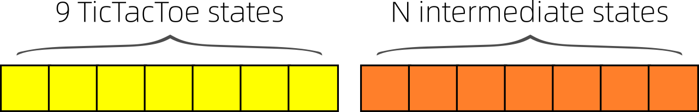

# RL with Auto-Encoder

RL 產生的 δx 是否应放进 自编码器？  
自编码器 的 x 明显是属于 RL state 的一部分  
似乎 二者的内容应该分享  
但 二者是如何融合？  
RL 根据什么给出 δx？每个 x 有价值函数  
AE 根据的是 reconstruction error  
但二者是否可以 同时运行而没有抵触？  
每个 algorithm 更新的其实是 weights 而已  
但状态的改变会否影响算法的收敛？  
在资料有限的情况下，  
算法收敛到能准确地解释资料的程度  

但如果将这架构 应用到 井子棋上则好像不行？  
问题是预测 TTT 的状态  
然后状态 再推导出行动

1. 有个问题是：RL 输出给 AE 有什么意思？  
因为 RL 其实直接输出下一步，  
而不是什么隐状态。除非令 RL = 多步逻辑！  
是可以的，但有些隐状态用来预测下一步  
似乎不合适。或者说：RL 的隐状态用来  
预测世界，总是合适的？
2. 另一个问题： 多步 RL 如何达成？  
辨别 隐状态 vs 动作状态  
似乎要增加 状态空间的长度。
3. 还有就是 多步逻辑的奖励问题  
价值函数是 associated with 全局状态  
但奖励可以是关于局部状态的  
可不可以 建构 状态的 **分拆**？

这种分拆似乎很重要。  
可不可以将 x 和 δx 的表述 显式地 写进 RL 里？  
例如 将 状态 = δx？那么全状态又是什么？

全状态 也是一个状态，所以应该做的是 状态的 **细致化**。

全局上，我们关心的是 状态 x 的价值，那么 V(x + δx) 能否表达成 V(x) 的推导？

1. 很明显 x + δx 是 x 的 下一个 reachable 状态。 
2. x + δx 的价值是外在定义的，但它跟 x + δx 的形式无关
3. 它是 action δx 导致的，这似乎跟动力学方程有关
4. 这是一种 状态 algebra 结构，原来的 RL 推演中没有
5. algebra of states 是如何影响 RL 的 formulation？  
似乎最简单的答案就是 定义 R(δx), 即每个 **命题** 的奖励。  
而 x 的奖励是 根据 δx 决定的。 甚至反而更直观、更易处理。

余下问题：RL 跟 AE 的 **互相干涉** :

1. RL 干涉 AE：  
AE 的中部突然出现外来的 tokens 会否影响其收敛？
RL 导致出现的是：  
a）关于事实的思考，  
b）关于行动的思考  
然后用这些来预测世界，合适吗？  
 (a) 还可以，但 (b) 似乎有些牵强？  
（例如期待某人被暗杀、所以关注军队有否叛变等各种蛛丝马迹）

2. AE 干涉 RL：  
RL 的状态中突然出现外来的 δx 会否影响 RL 的收敛？  
应该不会，因为状态从来是随着世界改变的。

我说明了可以收敛，但没有说明 有没有帮助？  
AE → RL 肯定是有帮助的  
RL → AE 或许可以用 special marker 标记  
后者或许可以帮助 AE 涌现更多智慧

为方便起见 设 N=9

Other than the board vector, we need an auxiliary store of propositions.

But it may be different from the board vector.

Each proposition is a discrete value from { 0...8 },
so 9 propositions has 99 combinations but with redundancy.

If not counting repeats, it is 9C1 + 9C2 +... + 9C9 = 29.

Two questions:

1. Shall we allow deleting (negating) a proposition?

2. Forgetting.  Perhaps we should use a list to implement this.
In our simple situation we can actually have "permanent" memory and
learning would still be OK.

究竟 多步逻辑 是不是有需要呢？  
以下棋作比喻，V 包含了每个思维的价值  
但思维与下棋是不是完全相似的？  
在思维空间里 每个状态 映射到 所有 δx 的概率分布  
状态 x 是包含很多个命题的，但这个 映射不能被分拆  
（这个映射的复杂性，适宜用深度神经网络处理）  
现在问题是 next thought  
如果直接输出 action 就行，为什么要 thoughts？  
thoughts 的奖励机制是很复杂的  
它涉及到 资讯压缩的 gains  
现在问题是：漫无目的地产生 thoughts，  
奖励机制 不明显。  
压缩的 loss function 似乎就是 world reconstruction loss.  
问题是有没有坚定不拨的 学习原则？  
既然 thought is action 则它必然符合 Bellman 条件  
但它似乎太 “free”，有没有其他的约束？  
「**双重约束**」是否在理论上一致？  

其实 RL 的 world model 也是根据 truth 而学习，而不是 Bellman  
那么 AE 也是根据 truth 而学习。 是不是根本没有矛盾？  

其实 GPT 的做法就是将 thoughts 外在化，变成自然语言  
