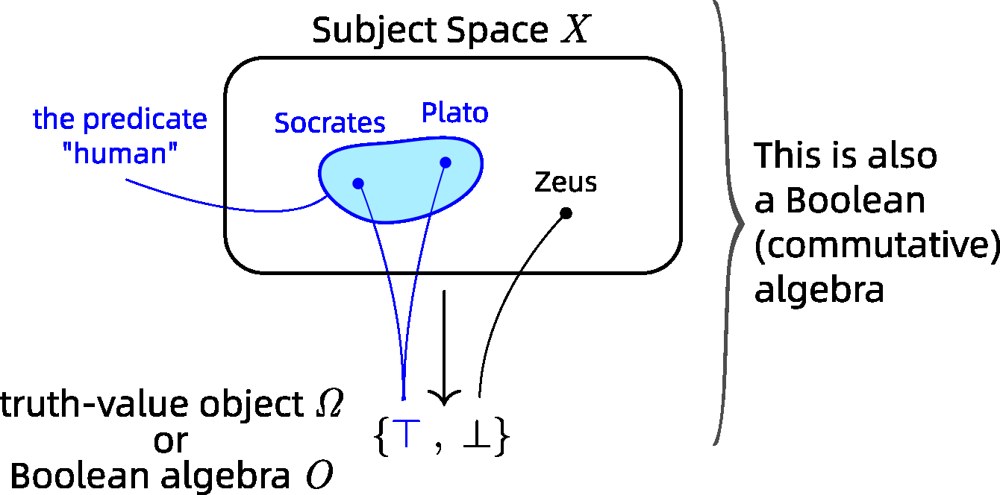

Algebraic Logic Learning
==============

### Halmos' algebraic logic

The biggest difficulty in turning logic into algebra is how to deal with **predicates**.  The solution adopted by Paul Halmos is to implement a predicate *P()* as a function *p()*, which looks very natural as their notations are even identical.  (This idea may be common to Tarski's **cylindric algebra** also, but I have yet to study the latter).

The functions such as *p()* are called **propositional functions** that maps from a (topological) space *X* to a Boolean algebra *A*.  The result (of the set of propositional functions) is also a Boolean algebra, denoted AX.  The space *X* is called the **dual space** of the algebra AX.  It contains the "subjects" that the predicates talk about.  For example *X* can be the set of creatures, and we can map them with predicates such as *human()*.  From an AI perspective, I call *X* the Subject Space.

A simpler case is when *A* is the 2-element Boolean algebra denoted as *O*.  Then the predicates simply map each element in the Subject Space to True or False.

The following diagram summarizes Halmos' algebraic logic in a nutshell:

### DQN (Deep Q Network)

In the DQN approach to Reinforcement Learning, the Q network learns the function *Q(s,a)* where *s* = state and *a* = action.  

In our logic approach, *Q(s,a)* is implemented by logic rules of the form *s* &vdash; *a*, where an "action" is regarded as logic deduction.