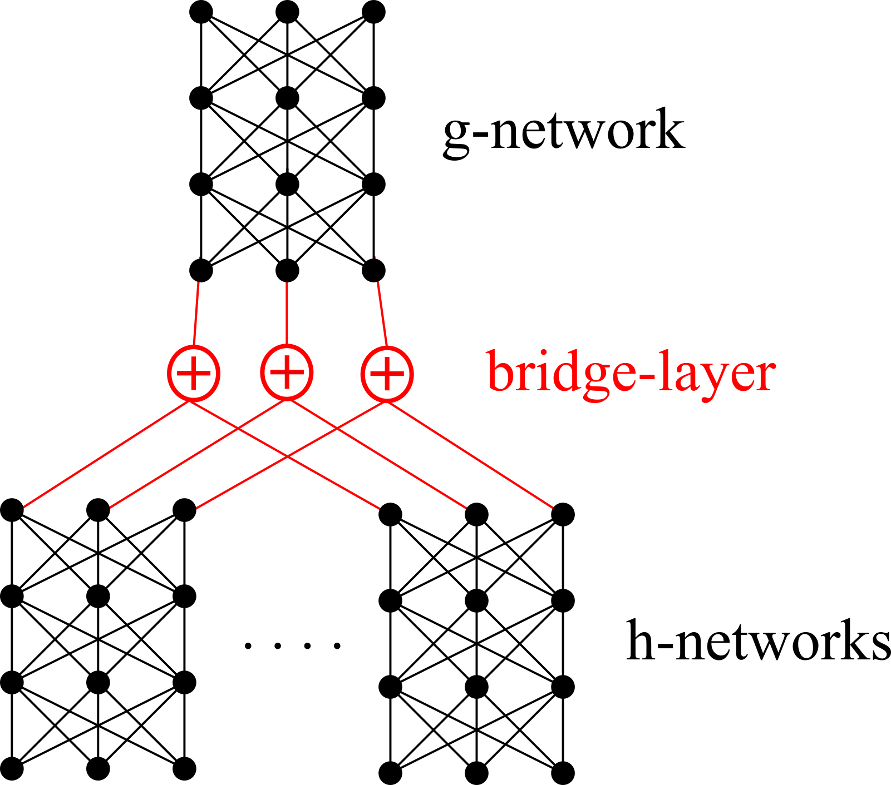
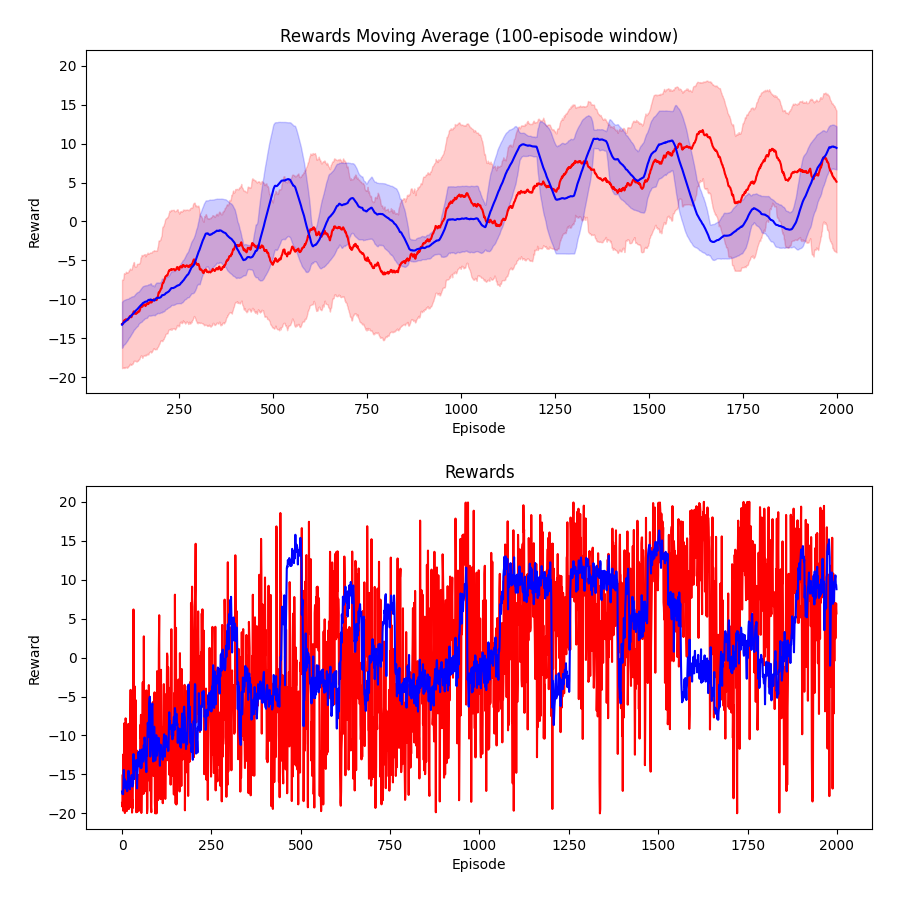

# Policy gradient with Symmetric NN

Experimenting with policy gradient algorithm with a symmetric (permutation-invariant) neural network.

## Theory

Reinforcement learning is founded on **Bellman's optimality condition**:

V(s) = maxa[ R(s,a) + γV(s') ]

At the basic level there are 2 techniques:

* **Policy iteration** starts with a specific policy &pi; and updates it with respect to its value V&pi;(s).

  The algorithm has 2 parts: policy *evaluation* and policy *improvement*.

* **Value iteration** updates V(s) or Q(s,a) for all states (the policy would be derived from the value function). The second form is known as **Q-learning**.

  Q(s,a) is a special form of the global value function V(s).  Their relation is such that V(s) is the *restriction* of Q(s,a) when a takes on its optimal value.  In other words:

  V(s) = maxa Q(s,a).

**DQN** (deep Q-learning) leads to the success story in 2013 playing "Atari games".

However, Q-learning requires to find the max of Q(s,a) in order to recover the optimal action.  If Q(s,a) is given by a neural network, such an operation is not always possible.  In the *discrete* case, we get around this problem by outputting the Q value for *each* action; but we cannot do that for *continuous* actions.

For AI problems we need to deal with actions in high-dimensional vector-space embeddings, so continuous actions are required.

The **policy gradient** method can get around this problem because it directly differentiates the cumulative reward against the policy, ie, calculate &nabla;&theta; J(&theta;) where J is the total reward and &theta; is the *parametrization* of the policy &pi;.  So it does not involve the V(s) or Q(s,a) functions.

The policy gradient method leads to the later development of **Actor-Critic** methods and also the **DDPG** (deep deterministic policy gradient) methods.  DDPG is able to incorporate some advantages of Q-learning and seems to be among the current state-of-the-art in reinforcement learning, but that's another story.

In this demo, I try to demonstrate that symmetric NN can be applied to policy gradient to achieve superior results in tasks that involve *logical reasoning*.

## Acknowledgement

[1] The policy gradient demo, which originally solves the **Cart Pole** problem, is borrow from Morvan Zhou (周沫凡/莫烦):
https://github.com/MorvanZhou/Reinforcement-learning-with-tensorflow

[2] The Tic-Tac-Toe AI Gym code is borrowed from Clément Romac:
https://clementromac.github.io/projects/gym-tictactoe/

[3] The DeepSets code is borrowed from the paper's original authors:
https://github.com/manzilzaheer/DeepSets

## Implementation details

First, I tried "plain" policy gradient on Tic Tac Toe, and convergence was slow (which seems reasonable).  The demo seems able to learn to avoid playing the positions where a piece is already there (which is an allowed move, but with a high penalty).  The score rises from negative values to 0, because the opponenet is a random player who automatically chooses from empty squares.  I only trained for several minutes.  After that, the score does not rise much above 0, and I am too impatient to continue training.

The next step is to put the symmetric NN into the reinforcement learner.  Here I need to change the state representation.

The "old" state vector is just a simple array of size 3 &times; 3 = 9, with each array element taking on values {1,0,-1} for players 1 and -1, and empty = 0.

The new state vector uses a **sequence** of moves to represent the state.  This is because I want the new state to be a **set** of propositions, not just one big proposition.

Each **proposition** = (x, y, p) is a vector of dimension 3, where (x, y) is the 3 &times; 3 square position and p represents player 1, -1 or empty (0).  All 3 numbers can vary continuously;  We just map some intervals to the discrete values.  This is analogous to the way we would embed "concepts" in vector space in the future.

This results in the symmetric NN looking like this:

where the overall symmetrtic function F has the form:

 F( x1, ..., xn ) = g( h(x1) + ... + h(x1) ).

## To run

(NOTE:  I am currently transitioning the code to pyTorch)

Requires

     TensorFlow 2.0
     or pyTorch 1.12.1
     Python 3.8

For example, on my Ubuntu computer I'd activate the virtual environment:

	 source ~/venv/bin/activate

Run this to install Gym TicTacToe:

     pip3 install gym==0.19.0
     cd gym-tictactoe
     python setup.py install

To check Gym version, in Python:

     >>> from gym.version import VERSION
     >>> print(VERSION)

To run the experiments:

     python run_TicTacToe.py
    
This will show a menu of choices:

1. PyTorch, symmetric NN
2. PyTorch, fully-connected NN
3. TensorFlow, symmetric NN
4. TensorFlow, fully-connected NN
5. PyTorch, Transformer [new!]

The other python programs are broken because I've modified RL_brain.py:

~~run_CartPole.py~~
~~run_MountainCar.py~~

This is a plot to compare the performance of "fully-connected" (blue) and "symmetric" (red) NN:

Convergence can be observed early on (1000-2000), but afterwards performance remains unstable though above average.  This behavior is observed in both the "plain" and "symmetric" version, indicating that it might be a problem in the policy gradient approach as applied to this game.

To plot graphs like the above: （This can be run during training!)

	python plot.py
	
The program will list a choice of all data files in the directory。

## Code comments

The following variables are roughly equivalent:

| pyTorch version | TensorFlow version |
| --- | --- |
| rewards | tf_vt, ep_rs_norm |
| policy_history | all_act |

Notice that each **episode** is one game of Tic Tac Toe, which is a sequence of (state, action, reward) tuples.  This sequence increments according to the **AI player's moves**, ie, each time step consists of one AI move and one "other" move.  

***

(The following are some notes for my personal reference)

From pyTorch version:

rewards = rewards centered at mean value / standard deviation

loss = policy_history x rewards

where `policy_history` is updated in `choose_action()`.

From Tensorflow version:

loss = reduce_mean( neg_log_prob * tf_vt )

neg_log_prob = softmax cross-entropy of (logits = all_act = output of NN)

tf_vt = discounted_ep_rs_norm
    = "rewards" in pyTorch version

logits = all_act = output of NN (as a batch, therefore it has the required length).
