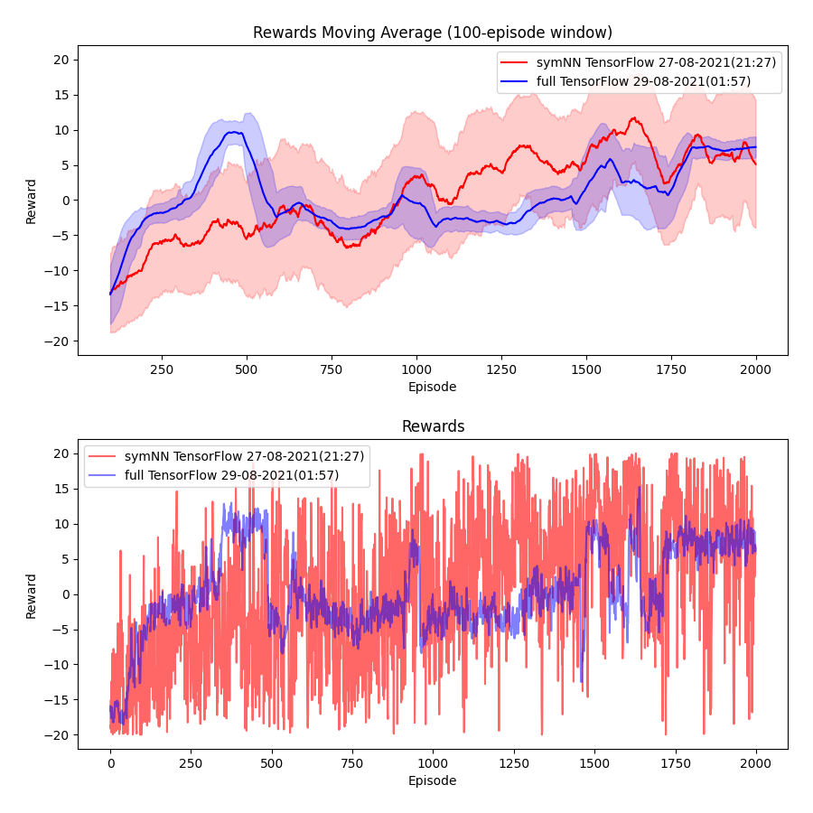

# Reinforcement Learning, TicTacToe experiments

Experimenting with various RL algorithms.

## Some RL theory

Reinforcement learning is founded on **Bellman's optimality condition**:

V(s) = maxa[ R(s,a) + γV(s') ]

At the basic level there are 2 techniques:

* **Policy iteration** starts with a specific policy &pi; and updates it with respect to its value V&pi;(s).  The algorithm has 2 parts: policy *evaluation* and policy *improvement*.

* **Value iteration** updates V(s) or Q(s,a) for all states (the policy would be derived from the value function). The second form is known as **Q-learning**.

  Q(s,a) is a special form of the global value function V(s).  Their relation is such that V(s) is the *restriction* of Q(s,a) when a takes on its optimal value.  In other words:

  V(s) = maxa Q(s,a).

**DQN** (deep Q-learning) leads to the success story in 2013 playing "Atari games".

## Problem of discrete actions

However, Q-learning requires to find the max of Q(s,a) in order to recover the optimal action.  If Q(s,a) is given by a neural network, such an operation is not always possible.  In the *discrete* case, we get around this problem by outputting the Q value for *each* action; but we cannot do that for *continuous* actions.

For AGI, we need to deal with actions in high-dimensional vector-space embeddings, so continuous actions seems required.  But I am experimenting with outputting the logits (ie, probability distribution) directly, which seems to circumvent this problem.  The Transformer outputs logits too.

The **policy gradient** method can get around this problem because it directly differentiates the cumulative reward against the policy, ie, calculate &nabla;&theta; J(&theta;) where J is the total reward and &theta; is the *parametrization* of the policy &pi;.  So it does not involve the V(s) or Q(s,a) functions.

The policy gradient method leads to the later development of **Actor-Critic** algorithms and also **DDPG** (deep deterministic policy gradient) and **PPO**.  

In this demo, I try to demonstrate that symmetric NN can be applied to RL to achieve superior results in tasks that involve *logical reasoning*.

## The state vector

The "plain" state vector is just a simple array of size 3 &times; 3 = 9, with each array element taking on values {1,0,-1} for players 1 and -1, and empty = 0.

The "logical" state vector uses a **sequence** of moves to represent the state.  This is because I want the new state to be a **set** of propositions, not just one big proposition.

Each **proposition** = (x, y, p) is a vector of dimension 3, where (x, y) is the 3 &times; 3 square position and p represents player 1, -1 or empty (0).  All 3 numbers can vary continuously;  We just map some intervals to the discrete values.  This is analogous to the way we would embed "concepts" in vector space in the future.

## To run

(NOTE:  I am currently transitioning the code to pyTorch)

Requires

     TensorFlow 2.0
     or pyTorch 1.12.1
     Python 3.8

For example, on my Ubuntu computer I'd activate the virtual environment:

	 source ~/venv/bin/activate

Run this to install Gym TicTacToe:

     pip3 install gym==0.19.0
     cd gym-tictactoe
     python setup.py install

To check Gym version, in Python:

     >>> from gym.version import VERSION
     >>> print(VERSION)

To run the experiments:

     python run_TicTacToe.py
    
This will show a menu of choices:

0. Python	Q-table
1. PyTorch	DQN
2. PyTorch	PG	symmetric NN
3. PyTorch	PG	fully-connected NN
4. TensorFlow	PG	symmetric NN
5. TensorFlow	PG	fully-connected NN
6. PyTorch	PG	Transformer
7. PyTorch	SAC	fully-connected NN
8. PyTorch	DQN	Transformer

Some options may be broken as I work on newer versions.  Ask me directly if you encounter problems.

This is a plot to compare the performance of "fully-connected" (blue) vs "symmetric" (red) NN:

Convergence can be observed early on (1000-2000), but afterwards performance remains unstable though above average.  This behavior is observed in both the "plain" and "symmetric" version, indicating that it might be a problem in the policy gradient approach as applied to this game.

To plot graphs like the above: （This can be run during training!)

	python plot.py
	
The program will list a choice of all data files in the directory.

## The GUI

This may require to install:

    npm install ws
    pip install websockets

Run the Websocket server:

    node ws.mjs &
    
Open the `GUI.html` file in your browser.

In the code `run_TicTacToe.py` you have to set `RENDER=1` or `2`.  Level 2 it renders every move, level 1 renders only the ending position.  But you can set `RENDER=_` by pressing Ctrl-C during run-time.  Remember to refresh the browser to connect the websocket.

## Acknowledgement

[1] The policy gradient demo, which originally solves the **Cart Pole** problem, is borrow from Morvan Zhou (周沫凡/莫烦):
https://github.com/MorvanZhou/Reinforcement-learning-with-tensorflow

[2] The Tic-Tac-Toe AI Gym code is borrowed from Clément Romac:
https://clementromac.github.io/projects/gym-tictactoe/

[3] The DeepSets code is borrowed from the paper's original authors:
https://github.com/manzilzaheer/DeepSets

